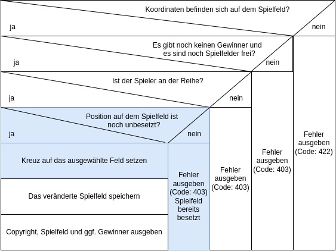

# Testaufgabe Ausbildung Fachinformtiker*in Anwendungsentwicklung
Diese Testaufgabe gilt es zu lösen, wenn Du einen Ausbildungsplatz bei der [MÜNSMEDIA GmbH](https://muensmedia.de) als Fachinformatiker*in Anwendungentwicklung ergattern willst.  
  
## Tic-Tac-Toe
[Tic-Tac-Toe](https://de.wikipedia.org/wiki/Tic-Tac-Toe) oder Drei gewinnt, ist ein einfaches Zweipersonen-Strategiespiel, das Du bestimmt schon selber gespielt hast.

## Spielablauf
Das Spielfeld besteht aus neun Feldern, die quadratisch (3 x 3) angeordnet sind.  
Die Spieler markieren abwechselnd eines der noch freien Felder mit einem Kreuz (:x:) bzw. Kringel (:o:).

Gewonnen hat, wer drei :x: bzw. :o: in einer Zeile, Spalte oder Diagonale – auch Mühle genannt – gekennzeichnet hat. Sind alle Felder belegt und keiner der Spieler hat gewonnen, so endet das Spiel unentschieden.

### Beispiel: X hat gewonnen

### Beispiel: Unentschieden

# Deine Aufgaben

## 1.) Vervollständige das Struktorgramm
Ein Nassi-Shneiderman-Diagramm oder auch **Struktogramm** ist ein Diagrammtyp zur Darstellung von Programmentwürfen im Rahmen der Methode der strukturierten Programmierung.  
Ein Struktogramm besteht immer aus den nachfolgenden Strukturblöcken, die ineinander geschachtelt oder miteinander kombiniert werden können:
### Anweisung
  
Jede Anweisung (Befehlsfolge), die das Programm abarbeiten soll, wird in einen rechteckigen Strukturblock geschrieben.
### Fallunterscheidung
  
Wenn die Bedingung zutreffend (wahr) ist, wird der Anweisungsblock 1 durchlaufen.
Trifft die Bedingung nicht zu (falsch), wird der Anweisungsblock 2 durchlaufen (if then else). Ein Anweisungsblock kann aus einer oder mehreren Anweisungen bestehen.
### Schleife mit Ausgangsbedingung
  
Der Schleifenkörper (Anweisungsblock 1) wird mindestens einmal durchlaufen, auch wenn die Bedingung von Anfang an nicht zutreffend (falsch) war!  
Die Bedingung, ob Anwendungsblock 1 erneut wiederholt werden soll, wird erst nach dem Durchlauf (dem Ausführen von Anwendungsblock 1) geprüft. Daraus ergibt sich, dass Anwendungsblock 1 mindestens einmal durchlaufen werden muss.

### Struktogramm Tic-Tac-Toe vervollständigen
Wir haben begonnen ein Struktogramm für das Spiel Tic-Tac-Toe zu erstellen.  
An einigen Stellen `(1), (2), (3), (4), (5), (6), (7)` war sich dein zukünftiger Ausbilder Malte nicht sicher. **Kannst Du ihm helfen?**

*Bitte notiere Deine Lösungen und füge diese bei Fertigstellung in Deine E-Mail an uns ein.*

## 2.) Programmierung vorbereiten
Nachdem Du jetzt weißt, wie Tic-Tac-Toe funktioniert, wollen wir zusammen programmieren.  
Keine Sorge, wenn Du bislang nur wenig oder gar nicht programmiert hast, wir steigern uns langsam 😉  
Wir wollen Deinen Quellcode sehen können und mir Dir an Deinem Quellcode arbeiten können, daher verwenden wir um den Quellcode kostenfrei auszutauschen, die Plattform GitHub.

### Bitte erledige die folgenden Schritte
- [ ] Du [verfügst bereits über einen GitHub-Account](https://github.com/login) **oder** [Du erstellst Dir einen kostenfreien GitHub-Account](https://github.com/join).
- [ ] Nachdem Du Dich bei Github.com angemeldet hast:
- [ ] Kopiere unseren Quellcode in Deinen GitHub-Account. Dazu musst Du nur den [folgenden Link klicken](https://github.com/muensmedia/testaufgabe/generate).
  - **Bitte stelle die Sichtbarkeit des neue Repositories - wie voreingestellt - auf `Public`.**
- [ ] Im neu erstellten GitHub-Repository scrollst Du herunter, bis Du diese Anleitung siehst.
- [ ] Du machst nun an dieser Stelle aus Deinem soeben erstellten Repository weiter.
- [ ] [Du öffnest Gitpod](https://gitpod.io/)
- [ ] Klicke `Continue with GitHub` und melde Dich mit Deinen GitHub-Zugangsdaten an.
- [ ] Erstelle durch einen Klick auf `New Workspace` eine neue Programmierumgebung.
- [ ] Wähle im sich öffnenden Dialog die Adresse Deines eben erstellten Repository aus.
- Die Arbeitsumgebung GitPod öffnet sich. *Das kann einige Sekunden dauern. Gedulde Dich.*
- [ ] Öffne dort nun diese Anleitung. Klicke dazu mit einem Rechtsklick auf die Datei `REDAME.md` und dann auf `Open Preview`.
- [ ] Fahre mit der Anleitung in Deiner Gitpod-Programmierumgebung fort.

## 3.) Copyright anpassen
Deine Tic-Tac-Toe Webanwendung besteht aus einem Frontend und einem Backend.  
Als Frontend verwenden wir das Tool `Swagger` mit dem man Schnittstellen mit einer grafischen Oberfläche einfach ausprobieren kann.  
Swagger haben wir Dir bereits im Browserfenster geöffnet.  
Als Backend verwenden wir eine [PHP-Anwendung](https://www.php.net/manual/en/) auf Basis des Frameworks [Laravel](https://laravel.com/docs/9.x).  

Wir haben eine Funktion vorbereitet, die das Copyright des Spiels ausgibt.

**Bitte probiere die API-Methode zur Anzeige des Copyrights in Swagger aus:**
- [ ] Klicke in Swagger dazu auf `/copyright`.
- [ ] Klicke auf den Button `Try it out`.
- [ ] Sende die Anfrage indem Du auf `Execute` drückst.
- Du siehst im Abschnitt `Response body` die Antwort mit dem aktuellen Copyright.

**Verändere das Copyright:**  
- [ ] Öffne die Datei [app/app/App/Http/Controllers/CopyrightController.php](app/app/App/Http/Controllers/CopyrightController.php) in Gitpod.
- [ ] In Zeile `18` wird das Copyright als String gespeichert.
- [ ] Benutze den in der `CopyrightController.php` verlinkten ASCII Generator um Dein persönliches Copyright zu erstellen.
- [ ] Ersetze das Copyright `By MÜNSMEDIA GmbH` durch Dein eigenes Copyright.
- [ ] Probier Dein neues Copyright mit Swagger aus!
- [ ] Du musst Deine Änderung nun noch speichern - **committen** genannt.
  - Klicke dazu in der linken Seitenleiste auf den Reiter `Source Control` oder drücken die Tasten <kbd>Strg</kbd>+<kbd>⇧</kbd>+<kbd>G</kbd> gleichzeitig.
  - Gib oben eine Textnachricht ein, die Deine Änderung bestmöglich beschreibt. **Bitte schreibe die Nachricht auf Englisch**.
  - Speichere die Nachricht mit <kbd>⏎</kbd>
  - Klicke den Button `Sync changes` um Deine Änderungen auf GitHub hochzuladen
  - 🎉 Du hast Deinen ersten Git-Commit soeben gemacht!

## 3.) Methode /play schreiben
Noch kannst Du nicht gegen den vom MÜNSMEDIA-Team programmierten Bot spielen.  
Es fehlt noch die Logik, was bei einem Aufruf der `/play`-API-Route passieren soll.

### Struktogramm für einen Spielzug
Anbei das Struktogramm für einen Spielzug von Dir.

**To-do:**
- [ ] Schau Dir in Ruhe das Struktogramm für einen Spielzug von Dir an!
- [ ] In der Datei [app/app/App/Http/Controllers/GameController.php](app/app/App/Http/Controllers/GameController.php) in der Methode `play()` - Zeile xyz fehlt noch die Logik.
  - Bitte ergänze die fehlende Logik, wir haben Dir Hilfestellungen in Form von Kommentaren im Quelltext hinterlassen.
- [ ] Teste deinen Spielzug in Swagger, die Funktion heißt dort ebenfalls `/play`.
